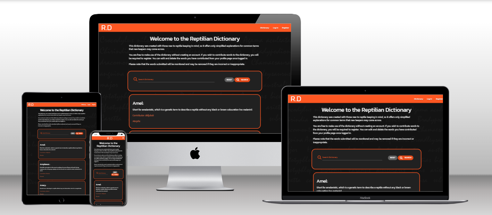
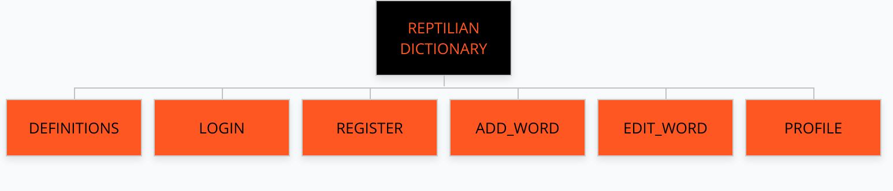
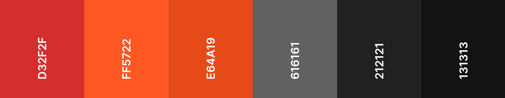

# Reptilian Dictionary
# Milestone Project 3 - Kelvin Nicholson

The purpose of this project was to create a multiple page website for a repitilian dictionary/glossary to allow users to view, edit and delete contributions.

[View live project here](https://mp3kel.herokuapp.com/)
--

---

# Table of Contents

* [UX](#ux)
* [TECHNOLOGIES USED](#technologies-used)
* [TESTING](#testing)
* [DEPLOYMENT](#deployment)
* [CREDITS](#credits)
---

# UX
* ## User Stories
  * First Time User Goals:
    * I want to understand the main purpose of the website.
    * I want to be able to easily understand and navigate the website.
    * I want to find terminology related to reptile keeping.
    * I want to be able contribute to the dictionary/glossary.

  * Returning User Goals:
    * I want to be able to edit or remove my previous contributions.
    * I want to be able to contact the website owner.
    * I want to be able to register and/or login.

  * Site Owner Goals:
    * I want the website to be easily found using search engines.
    * I want the website to clearly indicate it's purpose.
    * I want site visitors to be able to easily locate the definitions and their contributions.
    * I want site visitors to be able to register and login. 

* ## Strategy
  * Is to attract new users to the website, to provide them with common reptile keeping terminology and allow them to make contributions.

* ## Scope
  * Provide a clean/smooth UX for users.
  * Provide users with reptile keeping terminology.
  * Provide users the opportunity to contribute, if they wish to do so.
  * Provide a point of contact.

* ## Structure
  * Existing Features:
    * Six web pages:
      - Dictionary Page (Home) - Users can find a description about the purpose of the website. 
      - Login Page - Users have the ability to log in, as long as they have registered previously.
      - Register Page - Users have the ability to register an account to enable future logins.
      - Profile Page - Users can view their contributions to the glossary/dictionary. They can remove or edit these conributions.
      - Edit Word Page - Users can edit words they have previously contributed.
      - Add Word Page - Users can contribute a word to the dictionary/glossary.
    * Users can find contact information on the footer of every page.
    * Users will receive a 404 Page if they attempt to direct to a page which does not exist.
    * Navigation: 
      * Users can land on any page of the website and find what they need within 3 clicks.
      * Navigation bar is available on every page and has links to all pages or important functions (login, logout, register).
      * Home page has a search bar to enable users to search the dictionary.
      * Profile page has buttons beneath each word that will allow the user to remove or edit words.
      * The registration, login and logout options will show confirmation via a flash message displayed to the user.
      * User is redirected to Home Page when clicking on the logo.

  * Future Features:
    * As the dictionary grows, add pagination to reduce the amount of scrolling to be done when browsing through the dictionary.
    * Add admin priveledges to allow to admin to remove or edit contributions directly from the website without having to edit the database directly.
    * Add the ability to view terminology based off of categories.

* ## Skeleton
  * Wireframes:
    - Mobile: [Home]() | [Login]() | [Register]() | [Add Word]() | [Edit Word]() | [Profile]() 
    - Tablet: [Home]() | [Login]() | [Register]() | [Add Word]() | [Edit Word]() | [Profile]()
    - Desktop: [Home]() | [Login]() | [Register]() | [Add Word]() | [Edit Word]() | [Profile]()

  * Sitemap: 
    * All pages navigate to eachother through the use of buttons or the navigation bar.

    

  * 404 page:
    * User will be redirected to a 404 error page when attempting to access a page that no longer exists or is unavailable. This is the [404 page]().
    

* ## Surface 
  * Colour Scheme:

    

    * The colours for this project were chosen based off of contrast.

    * Persian Red (D32F2F)

    * Giants Orange (FF5722)

    * Flame (E64A19)

    * Dim Grey (616161)

    * Eerie Black (212121)

    * Night (131313)

    * Coral (FF7043) and white (FFFFFF) were used for text to increase contrast between text and backgrounds.

  * Typography:
    * One font was used throughout this website - 'Kanit'.

  * Imagery:
    * The only image used in this project is the background image. I created this image using Adobe Photoshop. The faint words on the image are the latin names for various South African reptiles.

---

# Technologies Used
* ## Languages
  * [HTML5](https://en.wikipedia.org/wiki/HTML5) - Used to structure the website.
  * [CSS3](https://en.wikipedia.org/wiki/CSS) - Used to style the content of the website.
  * [Python](https://en.wikipedia.org/wiki/Python_(programming_language)) - Used to create interactivity.

* ## Frameworks, Libraries & Programs
  * [Flask](https://en.wikipedia.org/wiki/Flask_(web_framework)) - Used for authentication, creating templates and url routing.
  * [MongoDB](https://www.mongodb.com/) - Used to host the database.
  * [Heroku](https://www.heroku.com/) - Used for deployment of application.
  * [Materialize]() - Used to make the website responsive, for card panels and for the design of the navigation bar / hamburger menu.
  * [Font Awesome](https://fontawesome.com/) - Used for the icons throughout the website.
  * [Google Fonts](https://fonts.google.com/) - Used to import the font-family used throughout the website: Kanit.
  * [Git](https://git-scm.com/) - Used for version control.
  * [GitHub](https://github.com/) - Used to create and host the repository for the website.
  * [Gitpod](https://gitpod.io/) - Integrated Development Environment used to develop the website.
  * [Wirefram.cc](https://wireframe.cc/) - Used for wireframing of the website.
  * [Coolors](https://coolors.co/) - Used to assemble an appropriate colour palette.
  * [Gloo Maps](https://www.gloomaps.com/) - Used to create sitemap.

---

# Testing
* Please see [TESTING.md](TESTING.md).

---

# Deployment
This project was deployed to GitHub pages. This project made use of the Code Institute template which can be found [here]().

## GitHub Pages
1. Log in to GitHub and locate this project's [repository]().
2. Select the "Settings" tab on the repository navigation bar.

3. Select the "Pages" tab on the left hand side menu.

4. Under "Branch", select the dropdown labelled "None" and change it to "Main". Select "Save".

5. The page will now refresh automatically and provide a link to the published site.

## Local Deployment
1. Log in to GitHub and locate this project's [repository]().

2. Select the "Code" dropdown and copy the link provided.

3. You can now paste this link into your IDE terminal.

---

# Credits

